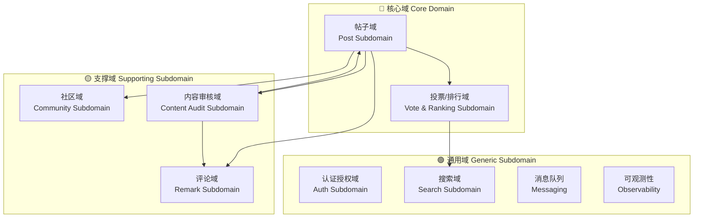
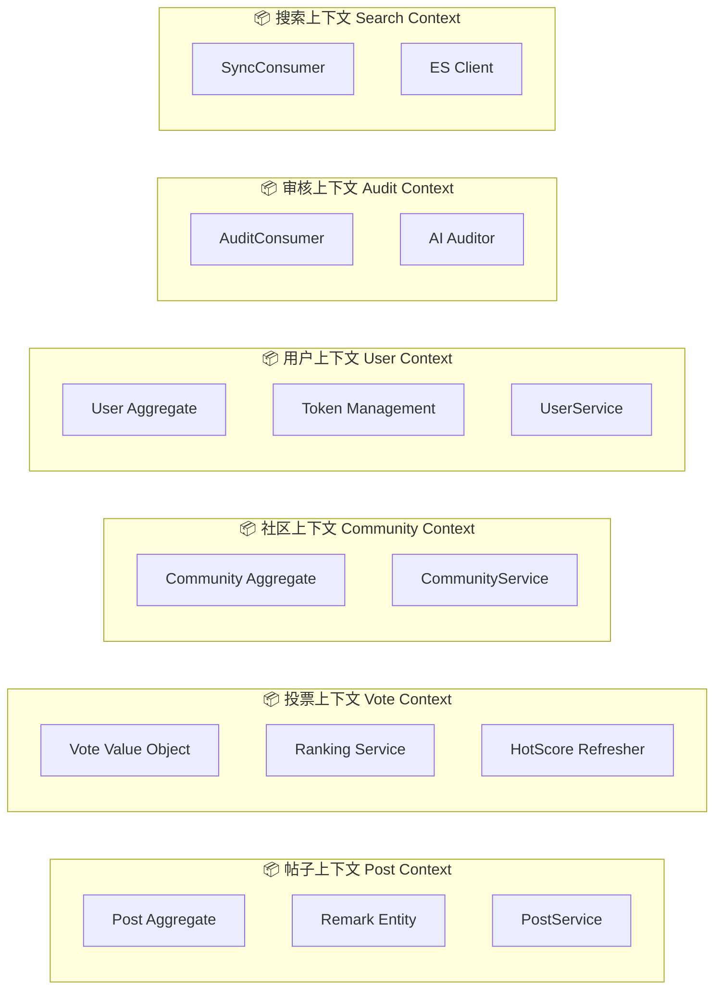
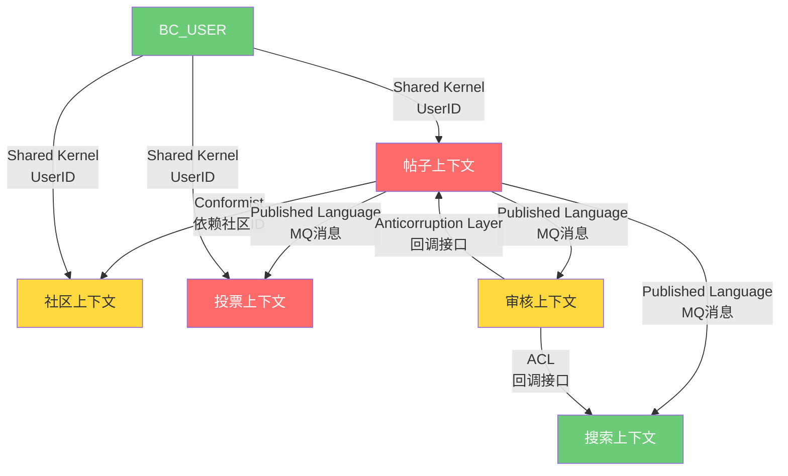
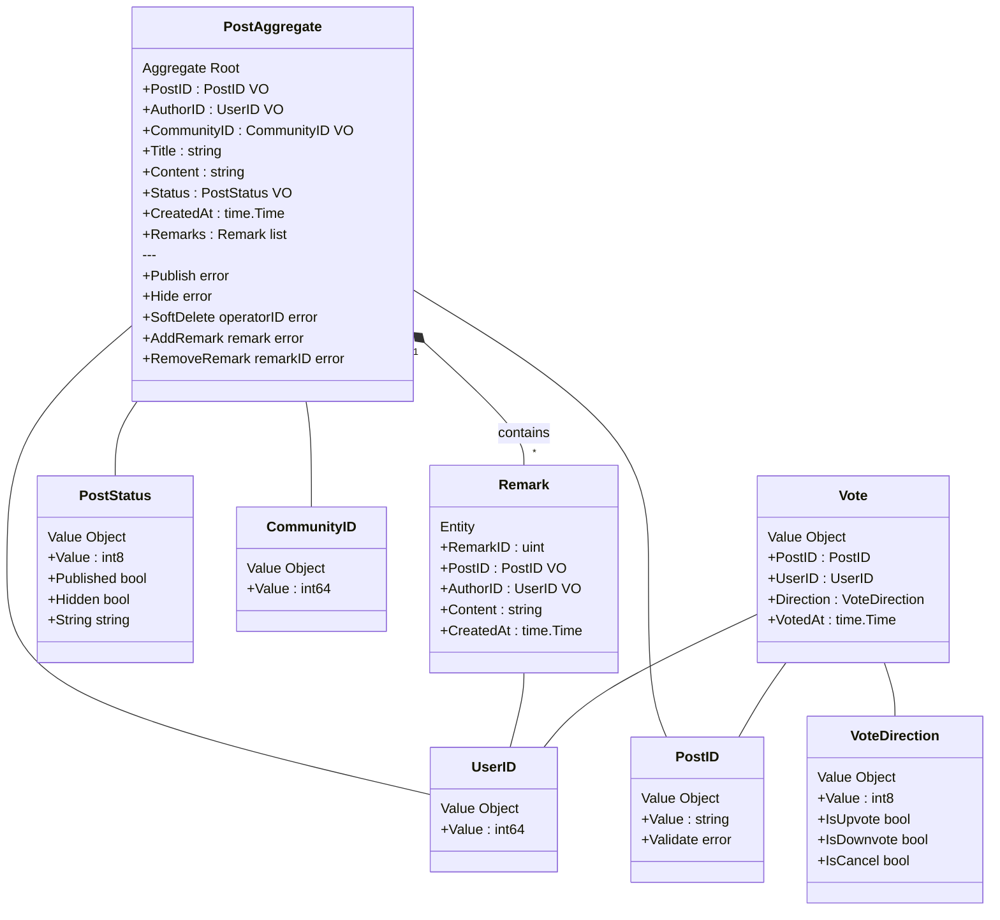
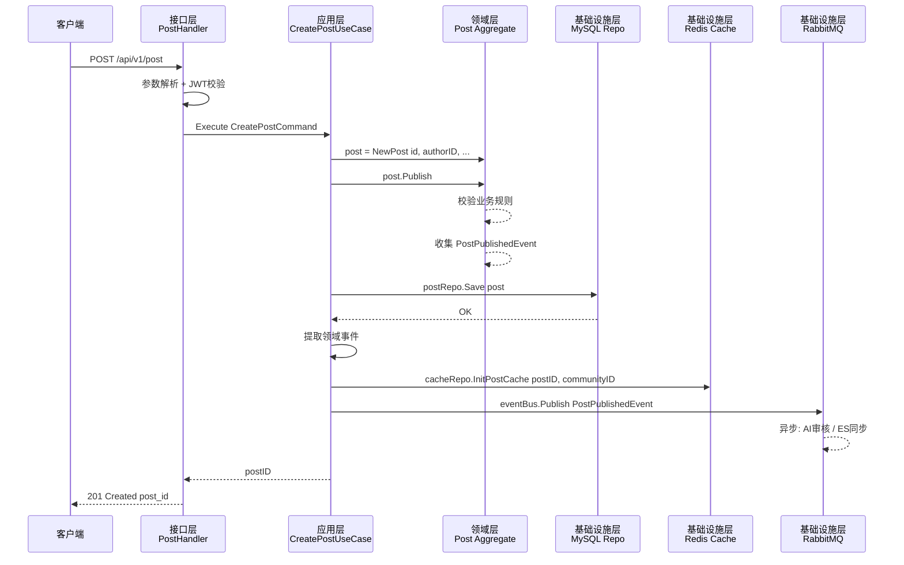

# Bluebell 社区论坛 — DDD 架构设计方案

> 基于对现有 Bluebell 项目源码的深度分析，从**战略设计**、**战术设计**、**架构实现**三个维度给出完整的领域驱动设计（DDD）方案。

---

## 目录

1. [项目概览](#1-项目概览)
2. [战略设计](#2-战略设计)
3. [战术设计](#3-战术设计)
4. [架构实现](#4-架构实现)
5. [现有架构对比与迁移建议](#5-现有架构对比与迁移建议)

---

## 1. 项目概览

Bluebell 是一个**社区论坛 Web 应用**，技术栈为 Go (Gin + GORM)，核心功能包括：

| 功能模块 | 关键能力 |
|---------|---------|
| 用户系统 | 注册、登录、JWT双令牌认证、SSO单点登录（Redis踢人） |
| 社区管理 | 社区列表/详情、管理员创建社区 |
| 帖子系统 | 发帖、列表(分页/排序)、详情、删除(软删除)、社区帖子列表 |
| 投票系统 | Redis原子投票(Lua脚本)、MQ异步落盘MySQL、热度排行榜 |
| 评论系统 | 发表评论、评论列表、删除违规评论 |
| 内容审核 | AI审核(MQ驱动)、审核不通过自动隐藏帖子/删除评论 |
| 搜索同步 | Elasticsearch 数据同步(MQ驱动) |
| 可观测性 | OpenTelemetry 链路追踪、zap 结构化日志 |

---

## 2. 战略设计

### 2.1 子域识别



#### 划分理由

| 分类 | 子域 | 理由 |
|------|------|------|
| **核心域** | 帖子域 | 论坛的核心价值主张，承载内容生产与消费的全生命周期 |
| **核心域** | 投票/排行域 | 社区活跃度的关键驱动力，包含复杂的Redis投票算法(Lua原子操作) + Gravity热度排序 |
| **支撑域** | 社区域 | 帖子的组织单元，业务规则简单但不可缺少 |
| **支撑域** | 评论域 | 内容互动的重要补充，业务逻辑相对独立 |
| **支撑域** | 内容审核域 | AI驱动的内容安全保障，与帖子/评论存在回调耦合 |
| **通用域** | 认证授权域 | 标准的JWT双令牌+SSO模式，可复用于任何系统 |
| **通用域** | 搜索域 | ES数据同步，通用的全文搜索方案 |
| **通用域** | 消息队列/可观测性 | 纯基础设施能力，与业务无关 |

### 2.2 限界上下文划分



### 2.3 上下文映射关系



#### 映射关系说明

| 上游 → 下游 | 关系模式 | 说明 |
|-------------|---------|------|
| 帖子 → 社区 | **Conformist (跟随者)** | 帖子上下文直接使用社区上下文的 `CommunityID`，没有自己的社区模型 |
| 帖子 → 投票 | **Published Language (发布语言)** | 通过 MQ `VoteMessage` 消息格式解耦，投票记录异步落盘 |
| 帖子 → 审核 | **Published Language** | 通过 MQ `AuditMessage` 触发AI审核 |
| 帖子 → 搜索 | **Published Language** | 通过 MQ `SyncMessage` 同步ES索引 |
| 审核 → 帖子 | **防腐层 (ACL)** | 审核回调通过 `PostService.UpdatePostStatus()` 接口隔离，不直接操作帖子数据 |
| 用户 ↔ 各上下文 | **Shared Kernel (共享内核)** | `UserID` 作为跨上下文的通用标识符 |

---

## 3. 战术设计

> 以**帖子域 (Post Subdomain)** 为核心示例，展开完整的战术设计。

### 3.1 聚合设计总览



### 3.2 聚合根 (Aggregate Root)

#### Post 聚合根

```go
// domain/post/aggregate.go

package post

import (
    "errors"
    "time"
)

// Post 帖子聚合根
// 聚合根是外部访问帖子相关数据的唯一入口
// 所有对 Remark 的操作都必须通过 Post 聚合根完成
type Post struct {
    id          PostID       // 值对象：帖子唯一标识
    authorID    UserID       // 值对象：作者ID
    communityID CommunityID  // 值对象：所属社区ID
    title       string
    content     string
    status      PostStatus   // 值对象：帖子状态
    remarks     []Remark     // 实体集合：评论列表
    createdAt   time.Time
    updatedAt   time.Time

    // 领域事件收集器
    events []DomainEvent
}

// Publish 发布帖子 — 包含业务不变量校验
func (p *Post) Publish() error {
    if p.title == "" || p.content == "" {
        return errors.New("title and content are required")
    }
    p.status = StatusPublished
    p.addEvent(PostPublishedEvent{
        PostID:      p.id,
        AuthorID:    p.authorID,
        CommunityID: p.communityID,
        OccurredAt:  time.Now(),
    })
    return nil
}

// Hide 隐藏帖子（审核不通过）
func (p *Post) Hide() error {
    if p.status == StatusHidden {
        return errors.New("post already hidden")
    }
    p.status = StatusHidden
    p.addEvent(PostHiddenEvent{
        PostID:     p.id,
        OccurredAt: time.Now(),
    })
    return nil
}

// SoftDelete 软删除帖子 — 只有作者本人可以删除
func (p *Post) SoftDelete(operatorID int64) error {
    if p.authorID.Value != operatorID {
        return errors.New("only author can delete post")
    }
    p.addEvent(PostDeletedEvent{
        PostID:      p.id,
        CommunityID: p.communityID,
        OccurredAt:  time.Now(),
    })
    return nil
}

// AddRemark 通过聚合根添加评论 — 维护帖子与评论的一致性边界
func (p *Post) AddRemark(authorID UserID, content string) (*Remark, error) {
    if p.status != StatusPublished {
        return nil, errors.New("cannot comment on unpublished post")
    }
    if content == "" {
        return nil, errors.New("remark content is required")
    }
    remark := Remark{
        postID:    p.id,
        authorID:  authorID,
        content:   content,
        createdAt: time.Now(),
    }
    p.remarks = append(p.remarks, remark)
    return &remark, nil
}
```

### 3.3 实体 (Entity)

```go
// domain/post/remark.go

package post

import "time"

// Remark 评论实体
// 有自己的唯一标识(ID)，生命周期从属于 Post 聚合根
type Remark struct {
    id        uint       // 实体标识
    postID    PostID     // 所属帖子
    authorID  UserID     // 评论作者
    content   string     // 评论内容
    createdAt time.Time
}

// ID 获取评论ID
func (r *Remark) ID() uint { return r.id }

// Content 获取评论内容
func (r *Remark) Content() string { return r.content }

// AuthorID 获取作者ID
func (r *Remark) AuthorID() UserID { return r.authorID }
```

### 3.4 值对象 (Value Object)

```go
// domain/post/value_objects.go

package post

import (
    "errors"
    "fmt"
)

// ========== PostID ==========

// PostID 帖子ID值对象
// 为什么是值对象：不可变、通过值相等性判断、无自身生命周期
type PostID struct {
    Value string
}

func NewPostID(v string) (PostID, error) {
    if v == "" {
        return PostID{}, errors.New("post id cannot be empty")
    }
    return PostID{Value: v}, nil
}

func (id PostID) String() string { return id.Value }

func (id PostID) Equals(other PostID) bool { return id.Value == other.Value }

// ========== PostStatus ==========

// PostStatus 帖子状态值对象
type PostStatus int8

const (
    StatusDraft     PostStatus = 0  // 草稿
    StatusPublished PostStatus = 1  // 已发布
    StatusHidden    PostStatus = -1 // 已隐藏（审核不通过）
)

func (s PostStatus) IsPublished() bool { return s == StatusPublished }
func (s PostStatus) IsHidden() bool    { return s == StatusHidden }
func (s PostStatus) String() string {
    switch s {
    case StatusDraft:
        return "draft"
    case StatusPublished:
        return "published"
    case StatusHidden:
        return "hidden"
    default:
        return fmt.Sprintf("unknown(%d)", s)
    }
}

// ========== VoteDirection ==========

// VoteDirection 投票方向值对象
type VoteDirection int8

const (
    VoteCancel   VoteDirection = 0  // 取消投票
    VoteUpvote   VoteDirection = 1  // 赞成
    VoteDownvote VoteDirection = -1 // 反对
)

func NewVoteDirection(v int8) (VoteDirection, error) {
    d := VoteDirection(v)
    if d != VoteCancel && d != VoteUpvote && d != VoteDownvote {
        return 0, fmt.Errorf("invalid vote direction: %d", v)
    }
    return d, nil
}

func (d VoteDirection) IsUpvote() bool   { return d == VoteUpvote }
func (d VoteDirection) IsDownvote() bool { return d == VoteDownvote }
func (d VoteDirection) IsCancel() bool   { return d == VoteCancel }

// ========== UserID / CommunityID ==========

type UserID struct{ Value int64 }
type CommunityID struct{ Value int64 }
```

### 3.5 领域事件 (Domain Event)

```go
// domain/post/events.go

package post

import "time"

// DomainEvent 领域事件接口
type DomainEvent interface {
    EventName() string
    OccurredOn() time.Time
}

// PostPublishedEvent 帖子发布事件
// 下游消费者：Redis缓存初始化、ES索引同步、AI内容审核
type PostPublishedEvent struct {
    PostID      PostID
    AuthorID    UserID
    CommunityID CommunityID
    Title       string
    Content     string
    OccurredAt  time.Time
}

func (e PostPublishedEvent) EventName() string    { return "post.published" }
func (e PostPublishedEvent) OccurredOn() time.Time { return e.OccurredAt }

// PostHiddenEvent 帖子隐藏事件（审核不通过触发）
// 下游消费者：ES索引删除
type PostHiddenEvent struct {
    PostID     PostID
    OccurredAt time.Time
}

func (e PostHiddenEvent) EventName() string    { return "post.hidden" }
func (e PostHiddenEvent) OccurredOn() time.Time { return e.OccurredAt }

// PostDeletedEvent 帖子删除事件
// 下游消费者：Redis缓存清理、ES索引删除
type PostDeletedEvent struct {
    PostID      PostID
    CommunityID CommunityID
    OccurredAt  time.Time
}

func (e PostDeletedEvent) EventName() string    { return "post.deleted" }
func (e PostDeletedEvent) OccurredOn() time.Time { return e.OccurredAt }

// VoteSubmittedEvent 投票提交事件
// 下游消费者：MySQL异步落盘(VoteConsumer)
type VoteSubmittedEvent struct {
    PostID     PostID
    UserID     UserID
    Direction  VoteDirection
    OccurredAt time.Time
}

func (e VoteSubmittedEvent) EventName() string    { return "vote.submitted" }
func (e VoteSubmittedEvent) OccurredOn() time.Time { return e.OccurredAt }
```

### 3.6 领域服务 (Domain Service)

```go
// domain/post/service.go

package post

import "context"

// PostDomainService 帖子领域服务
// 封装跨聚合或不自然属于单个聚合的业务逻辑
type PostDomainService interface {
    // CalculateHotScore 计算帖子热度分数
    // 跨越 Post 和 Vote 两个概念，不属于任一聚合根
    // 使用 Gravity 算法：Score = (Upvotes - Downvotes) / (T + 2)^G
    CalculateHotScore(upvotes, downvotes int64, postAge float64) float64

    // ValidateVote 投票合法性校验
    // 涉及时间窗口校验（发帖后一周内可投票），跨帖子生命周期
    ValidateVote(ctx context.Context, postID PostID, userID UserID, direction VoteDirection) error
}

// VotingService 投票领域服务
// 为什么独立服务：投票逻辑涉及 Redis 原子操作、MQ 异步落盘、
// 排行榜更新等多个关注点，不适合放入 Post 聚合根
type VotingService interface {
    // Vote 执行投票操作
    // 1. Redis Lua 原子操作（检查旧值 + 更新）
    // 2. 发布 VoteSubmittedEvent 到 MQ
    Vote(ctx context.Context, userID UserID, postID PostID, communityID CommunityID, direction VoteDirection) error
}

// RankingService 排行榜领域服务
type RankingService interface {
    // GetTopPosts 获取热度排行榜
    GetTopPosts(ctx context.Context, size int64) ([]PostID, []float64, error)
    // GetCommunityTopPosts 获取社区排行榜
    GetCommunityTopPosts(ctx context.Context, communityID CommunityID, size int64) ([]PostID, []float64, error)
}
```

### 3.7 仓储接口 (Repository Interface)

```go
// domain/post/repository.go

package post

import "context"

// PostRepository 帖子仓储接口（属于领域层）
// 只定义领域对象的持久化契约，不关心具体存储技术
type PostRepository interface {
    Save(ctx context.Context, post *Post) error
    FindByID(ctx context.Context, id PostID) (*Post, error)
    FindByIDs(ctx context.Context, ids []PostID) ([]*Post, error)
    Delete(ctx context.Context, id PostID) error
    UpdateStatus(ctx context.Context, id PostID, status PostStatus) error
}

// PostCacheRepository 帖子缓存仓储接口
type PostCacheRepository interface {
    InitPostCache(ctx context.Context, postID PostID, communityID CommunityID) error
    GetOrderedPostIDs(ctx context.Context, orderKey string, page, size int64) ([]PostID, error)
    DeletePostCache(ctx context.Context, postID PostID, communityID CommunityID) error
}
```

---

## 4. 架构实现

### 4.1 整洁架构四层逻辑图

```mermaid
graph TB
    subgraph 接口层["🌐 接口层 Interface Adapter Layer"]
        direction LR
        HTTP["HTTP Handler<br/>Gin"]
        MW["Middleware<br/>JWT/CORS/RateLimit"]
        ROUTER["Router"]
        SWAGGER["Swagger Docs"]
    end

    subgraph 应用层["⚙️ 应用层 Application Use Case Layer"]
        direction LR
        UC_POST["PostUseCase<br/>创建/查询/删除帖子"]
        UC_USER["UserUseCase<br/>注册/登录/刷新Token"]
        UC_COMMUNITY["CommunityUseCase<br/>社区管理"]
        UC_VOTE["VoteUseCase<br/>投票/排行榜"]
        DTO_IN["Request DTO"]
        DTO_OUT["Response DTO"]
        EVENT_PUB["Event Publisher<br/>应用事件分发"]
    end

    subgraph 领域层["💎 领域层 Domain Layer"]
        direction LR
        AGG["Aggregates<br/>Post, User, Community"]
        VO["Value Objects<br/>PostID, PostStatus..."]
        DS["Domain Services<br/>VotingService, RankingService"]
        DE["Domain Events<br/>PostPublished, VoteSubmitted..."]
        REPO_IF["Repository Interfaces<br/>契约定义"]
    end

    subgraph 基础设施层["🔧 基础设施层 Infrastructure Layer"]
        direction LR
        MYSQL["MySQL Repository<br/>GORM"]
        REDIS["Redis Repository<br/>go-redis"]
        MQ_INFRA["RabbitMQ<br/>Publisher/Consumer"]
        ES_INFRA["Elasticsearch<br/>Client"]
        AI_INFRA["AI Auditor<br/>OpenAI API"]
        JWT_INFRA["JWT Provider"]
        SF["Snowflake ID"]
        OTEL["OpenTelemetry"]
        LOG["Zap Logger"]
    end

    HTTP --> UC_POST
    HTTP --> UC_USER
    HTTP --> UC_COMMUNITY
    HTTP --> UC_VOTE
    UC_POST --> AGG
    UC_POST --> DS
    UC_POST --> REPO_IF
    UC_VOTE --> DS
    MYSQL -.->|implements| REPO_IF
    REDIS -.->|implements| REPO_IF
    MQ_INFRA -.->|implements| EVENT_PUB

    style 接口层 fill:#4ecdc4,color:#fff
    style 应用层 fill:#45b7d1,color:#fff
    style 领域层 fill:#f9ca24,color:#333
    style 基础设施层 fill:#6c5ce7,color:#fff
```



### 4.2 依赖方向 (Dependency Rule)

```
┌─────────────────────────────────────────────────────────────┐
│                                                             │
│   🌐 接口层 ──depends on──▶ ⚙️ 应用层                         │
│                              │                              │
│                        depends on                           │
│                              ▼                              │
│                         💎 领域层   ◀──implements── 🔧 基础设施层│
│                       (最内层，零依赖)                         │
│                                                             │
└─────────────────────────────────────────────────────────────┘

依赖规则（The Dependency Rule）：
• 外层可以依赖内层，内层绝不依赖外层
• 领域层是最内层，不依赖任何外部框架（无 Gin、GORM、Redis 依赖）
• 基础设施层实现领域层定义的接口（依赖反转, DIP）
• 应用层编排用例，协调领域对象和基础设施
```

### 4.3 各层职责说明

| 层级 | 职责 | 对应现有代码 |
|------|------|------------|
| **接口层** | HTTP请求解析、参数校验、响应格式化、中间件（认证/限流/CORS/链路追踪） | `internal/handler/`, `internal/router/`, `internal/middleware/` |
| **应用层** | 用例编排、事务管理、DTO转换、事件发布、跨聚合协调 | `internal/service/` (当前混合了部分领域逻辑) |
| **领域层** | 聚合根、实体、值对象、领域服务、领域事件、仓储接口 | `internal/domain/` (当前仅有接口定义), `internal/model/` (当前是贫血模型) |
| **基础设施层** | 数据库访问、缓存操作、消息队列、外部API调用、ID生成、日志 | `internal/dao/`, `internal/infrastructure/`, `internal/service/mq/` |

### 4.4 推荐的 Go 项目目录结构

```
bluebell/
├── cmd/
│   └── bluebell/
│       └── main.go                    # 应用入口，DI容器组装
│
├── internal/
│   │
│   ├── domain/                        # 💎 领域层（零外部依赖）
│   │   ├── post/                      # ── 帖子限界上下文 ──
│   │   │   ├── aggregate.go           #   Post 聚合根
│   │   │   ├── remark.go              #   Remark 实体
│   │   │   ├── value_objects.go       #   PostID, PostStatus 等值对象
│   │   │   ├── events.go             #   PostPublished, PostDeleted 等领域事件
│   │   │   ├── repository.go          #   PostRepository 接口定义
│   │   │   └── service.go             #   领域服务接口(VotingService, RankingService)
│   │   │
│   │   ├── user/                      # ── 用户限界上下文 ──
│   │   │   ├── aggregate.go           #   User 聚合根
│   │   │   ├── value_objects.go       #   UserID, Password 等值对象
│   │   │   ├── repository.go          #   UserRepository 接口
│   │   │   └── service.go             #   认证领域服务接口
│   │   │
│   │   ├── community/                 # ── 社区限界上下文 ──
│   │   │   ├── aggregate.go           #   Community 聚合根
│   │   │   ├── repository.go          #   CommunityRepository 接口
│   │   │   └── service.go             #   社区领域服务
│   │   │
│   │   ├── vote/                      # ── 投票限界上下文 ──
│   │   │   ├── value_objects.go       #   Vote, VoteDirection 值对象
│   │   │   ├── repository.go          #   VoteRepository 接口
│   │   │   └── service.go             #   投票/排行榜领域服务
│   │   │
│   │   └── shared/                    # ── 共享内核 ──
│   │       ├── event.go               #   DomainEvent 接口
│   │       └── identifiers.go         #   跨上下文的通用ID类型
│   │
│   ├── application/                   # ⚙️ 应用层（用例编排）
│   │   ├── post/
│   │   │   ├── command/               #   写操作用例
│   │   │   │   ├── create_post.go     #     CreatePostUseCase
│   │   │   │   ├── delete_post.go     #     DeletePostUseCase
│   │   │   │   ├── vote_post.go       #     VotePostUseCase
│   │   │   │   └── remark_post.go     #     RemarkPostUseCase
│   │   │   ├── query/                 #   读操作用例
│   │   │   │   ├── get_post.go        #     GetPostByIDQuery
│   │   │   │   ├── list_posts.go      #     ListPostsQuery
│   │   │   │   └── get_remarks.go     #     GetPostRemarksQuery
│   │   │   └── dto/                   #   DTO定义
│   │   │       ├── request.go
│   │   │       └── response.go
│   │   │
│   │   ├── user/
│   │   │   ├── command/
│   │   │   │   ├── signup.go
│   │   │   │   └── login.go
│   │   │   ├── query/
│   │   │   │   └── get_user.go
│   │   │   └── dto/
│   │   │       ├── request.go
│   │   │       └── response.go
│   │   │
│   │   ├── community/
│   │   │   ├── command/
│   │   │   │   └── create_community.go
│   │   │   ├── query/
│   │   │   │   ├── list_communities.go
│   │   │   │   └── get_community.go
│   │   │   └── dto/
│   │   │       ├── request.go
│   │   │       └── response.go
│   │   │
│   │   └── event/                     #   应用事件处理器
│   │       ├── handler.go             #     事件路由
│   │       └── post_event_handler.go  #     帖子事件处理(缓存同步/ES同步/审核触发)
│   │
│   ├── interfaces/                    # 🌐 接口层（适配器）
│   │   ├── http/
│   │   │   ├── handler/
│   │   │   │   ├── post_handler.go
│   │   │   │   ├── user_handler.go
│   │   │   │   └── community_handler.go
│   │   │   ├── middleware/
│   │   │   │   ├── auth.go
│   │   │   │   ├── cors.go
│   │   │   │   ├── ratelimit.go
│   │   │   │   ├── timeout.go
│   │   │   │   └── tracing.go
│   │   │   └── router.go
│   │   │
│   │   └── consumer/                  #   MQ 消费者（也是接口层的一种）
│   │       ├── vote_consumer.go
│   │       ├── audit_consumer.go
│   │       └── sync_consumer.go
│   │
│   └── infrastructure/                # 🔧 基础设施层
│       ├── persistence/
│       │   ├── mysql/
│       │   │   ├── post_repository.go    #  实现 domain/post/PostRepository
│       │   │   ├── user_repository.go    #  实现 domain/user/UserRepository
│       │   │   ├── community_repo.go     #  实现 domain/community/CommunityRepository
│       │   │   ├── vote_repository.go    #  实现 domain/vote/VoteRepository
│       │   │   ├── converter.go          #  领域模型 <=> 数据库模型 转换器
│       │   │   └── init.go               #  数据库连接初始化
│       │   └── redis/
│       │       ├── post_cache.go         #  实现 domain/post/PostCacheRepository
│       │       ├── token_cache.go        #  Token缓存
│       │       ├── hot_score.go          #  热度分数刷新
│       │       └── init.go               #  Redis连接初始化
│       │
│       ├── messaging/
│       │   ├── rabbitmq/
│       │   │   ├── connection.go         #  RabbitMQ 连接管理
│       │   │   ├── publisher.go          #  消息发布器
│       │   │   └── message.go            #  消息格式定义
│       │   └── event_bus.go              #  实现 application/EventPublisher 接口
│       │
│       ├── search/
│       │   └── elasticsearch/
│       │       ├── client.go             #  ES 客户端
│       │       └── post_index.go         #  帖子索引管理
│       │
│       ├── auth/
│       │   └── jwt/
│       │       └── jwt.go                #  JWT 令牌生成/验证
│       │
│       ├── idgen/
│       │   └── snowflake.go              #  雪花ID生成器
│       │
│       ├── ai/
│       │   └── auditor.go                #  AI审核客户端
│       │
│       └── observability/
│           ├── logger.go                 #  zap日志
│           └── otel.go                   #  OpenTelemetry初始化
│
├── pkg/                               # 公共工具包（跨项目复用）
│   ├── errorx/                        #   统一错误处理
│   └── enum/                          #   枚举常量
│
├── config/                            # 配置
│   ├── config.go
│   └── config.yaml
│
├── docs/                              # Swagger文档
├── sql/                               # 数据库迁移脚本
├── frontend/                          # 前端代码
├── docker-compose.yml
├── Dockerfile
├── Makefile
└── go.mod
```

### 4.5 关键改进：贫血模型 → 充血模型

当前项目使用的是典型的**贫血模型（Anemic Domain Model）**：

```diff
 // ❌ 当前：model/post.go — 纯数据结构，无业务行为
 type Post struct {
     gorm.Model
     PostID      string
     AuthorID    int64
     Content     string
     Status      int8
 }
 // 业务逻辑全部被拉到 service 层

 // ✅ 目标：domain/post/aggregate.go — 充血模型
 type Post struct {
     id       PostID
     authorID UserID
     content  string
     status   PostStatus
     remarks  []Remark
+    events   []DomainEvent  // 事件收集
 }
+
+// 业务行为内聚在聚合根中
+func (p *Post) Hide() error { ... }
+func (p *Post) SoftDelete(operatorID int64) error { ... }
+func (p *Post) AddRemark(authorID UserID, content string) error { ... }
```

### 4.6 数据流示意：创建帖子



---

## 5. 现有架构对比与迁移建议

### 5.1 现有架构评价

| 维度 | 现状 | 评分 | 说明 |
|------|------|------|------|
| 分层清晰度 | Handler → Service → DAO | ⭐⭐⭐⭐ | 三层分离做得很好 |
| 接口抽象 | `domain/svcdomain`, `dbdomain`, `cachedomain` | ⭐⭐⭐⭐ | 已有完整的接口定义和依赖反转 |
| DI依赖注入 | 手动构造器注入 | ⭐⭐⭐⭐ | 清晰的构造函数注入链 |
| 领域模型 | 贫血模型 model 只有数据结构 | ⭐⭐ | 缺少业务行为内聚 |
| 领域事件 | 未显式定义 通过MQ消息隐式传递 | ⭐⭐ | 事件语义不明确 |
| 聚合边界 | 未定义 | ⭐ | Post和Remark的一致性边界不清晰 |
| CQRS | 未分离 | ⭐⭐ | 读写混合在同一Service中 |

### 5.2 渐进式迁移路线图

> [!IMPORTANT]
> DDD重构是一个渐进式过程，**不建议一次性大规模重写**。建议按以下优先级逐步推进：

| 阶段 | 改动 | 风险等级 | 预估工作量 |
|------|------|---------|-----------|
| **Phase 1** | 引入值对象 PostID, PostStatus, VoteDirection | 🟢 低 | 1-2天 |
| **Phase 2** | 将 `model/` 中的GORM模型迁移到 `infrastructure/persistence/` 作为PO，领域层定义纯领域对象 | 🟡 中 | 3-5天 |
| **Phase 3** | Post聚合根添加业务方法 Publish, Hide, SoftDelete | 🟡 中 | 2-3天 |
| **Phase 4** | 引入显式领域事件，替换隐式MQ消息 | 🟡 中 | 3-5天 |
| **Phase 5** | 应用层拆分 Command/Query CQRS | 🟠 中高 | 5-7天 |
| **Phase 6** | 完整的目录结构迁移 | 🔴 高 | 7-10天 |

> [!TIP]
> 当前项目的架构已经**相当优秀** — 清晰的分层、完善的接口抽象、规范的DI注入。核心差距在于领域层还是"接口定义层"而非"业务规则内聚层"。如果项目规模保持在当前级别，现有架构的投入产出比可能比完整DDD更优。**DDD的价值在复杂度不断增长时才会显现**。

---

> 📋 **文档信息**
> - 项目: Bluebell 社区论坛
> - 基于源码: `d:\download\project\bluebell\`
> - 创建时间: 2026-04-10
