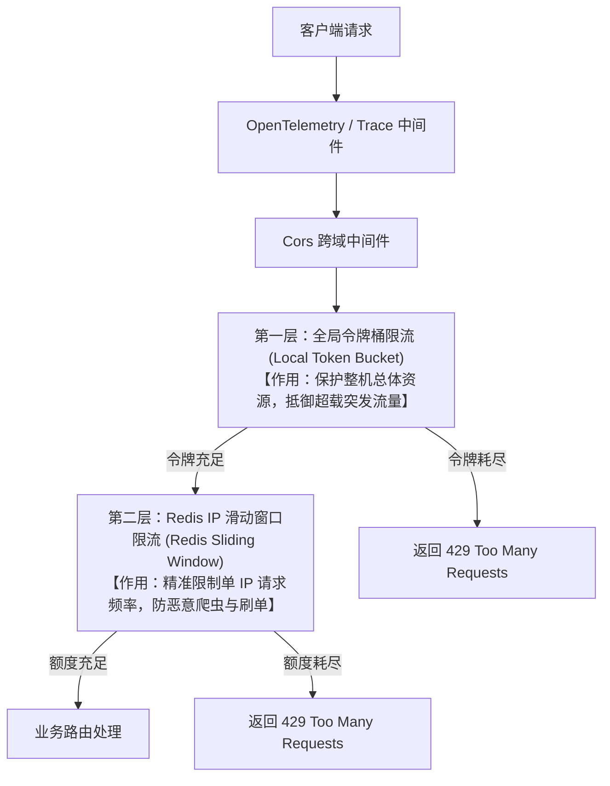

# Bluebell 项目限流架构与实现指南

本项目采用了**分层限流防御 (Layered Rate Limiting)** 架构，结合了**单机内存全局令牌桶**与**分布式 Redis IP 滑动窗口**两套限流方案，实现了粗粒度整体防护与细粒度单点限制的双重安全保障。

---

## 1. 分层限流架构设计 (Layered Architecture)

当两套限流策略同时启用时，所有 API 请求将按顺序依次流经以下两道关卡：



### 1.1 第一层：全局令牌桶限流 (Local Token Bucket)
* **实现载体**：基于内存单例桶（使用 `github.com/juju/ratelimit`）。
* **限流维度**：**全局总体流量**（对所有连接一视同仁）。
* **业务目的**：兜底系统最大承载上限，防止总体流量过载导致服务器 CPU、内存撑爆。
* **部署特征**：单机独占令牌，集群部署时各实例互不共享。

### 1.2 第二层：Redis IP 滑动窗口限流 (Distributed Sliding Window)
* **实现载体**：基于 Redis `ZSET` 结构 + 保证原子性的 Lua 脚本。
* **限流维度**：**单个客户端 IP 维度**。
* **业务目的**：防止单一恶意客户端或爬虫的高频接口调用，保障接口服务对普通大众用户的公平性。
* **部署特征**：分布式共享，多实例部署时，同一 IP 在不同机器上的请求额度会合并计算。

---

## 2. 完整限流配置

**`config.yaml`**:
```yaml
# 1. 全局令牌桶限流配置
ratelimit:
  fill_interval: "1ns"         # 填充间隔 (开发调试环境下可配 1ns / 极大 capacity 来关闭限制)
  capacity: 999999999999       # 桶最大容量

# 2. Redis IP 滑动窗口限流配置
sliding_ratelimit:
  enabled: true                # 是否启用滑动窗口限流
  window: "60s"                # 滑动窗口时长
  limit: 100                   # 在该窗口时长内允许的最大请求数
```

**`config.toml`** / **`config.docker.toml`**:
```toml
[ratelimit]
fill_interval = "10ms"
capacity = 200

[sliding_ratelimit]
enabled = true
window = "60s"
limit = 100
```

---

## 3. Go 配置映射结构体

在 [internal/config/config.go](file:///D:/download/project/bluebell/internal/config/config.go) 中映射：

```go
type rateLimitConfig struct {
	FillInterval string `mapstructure:"fill_interval"`
	Capacity     int64  `mapstructure:"capacity"`
}

type slidingRateLimitConfig struct {
	Enabled bool   `mapstructure:"enabled"`
	Window  string `mapstructure:"window"`
	Limit   int64  `mapstructure:"limit"`
}

type Config struct {
	// ...
	RateLimit        *rateLimitConfig        `mapstructure:"ratelimit"`
	SlidingRateLimit *slidingRateLimitConfig `mapstructure:"sliding_ratelimit"`
	// ...
}
```

---

## 4. 全局令牌桶限流中间件

实现文件为 [internal/middleware/ratelimit_token.go](file:///D:/download/project/bluebell/internal/middleware/ratelimit_token.go)：

```go
package middleware

import (
	"net/http"
	"sync/atomic"
	"time"

	"bluebell/internal/domain/entity"

	"github.com/gin-gonic/gin"
	"github.com/juju/ratelimit"
	"go.uber.org/zap"
)

var (
	totalRequests   int64
	limitedRequests int64
)

func RateLimitMiddleware(fillInterval time.Duration, capacity int64) gin.HandlerFunc {
	bucket := ratelimit.NewBucket(fillInterval, capacity)

	zap.L().Info("RateLimitMiddleware initialized",
		zap.Duration("fillInterval", fillInterval),
		zap.Int64("capacity", capacity),
		zap.Float64("ratePerSecond", float64(time.Second)/float64(fillInterval)))

	return func(c *gin.Context) {
		atomic.AddInt64(&totalRequests, 1)

		if bucket.TakeAvailable(1) < 1 {
			atomic.AddInt64(&limitedRequests, 1)
			limited := atomic.LoadInt64(&limitedRequests)
			total := atomic.LoadInt64(&totalRequests)
			zap.L().Warn("Rate limit triggered",
				zap.Int64("limited", limited),
				zap.Int64("total", total),
				zap.Float64("rate", float64(limited)/float64(total)*100))

			c.Header("Retry-After", "1")
			c.Header("X-RateLimit-Limit", "rate-limited")
			c.AbortWithStatusJSON(http.StatusTooManyRequests, gin.H{
				"error": entity.ErrRateLimitExceeded.Error(),
			})
			return
		}

		c.Next()
	}
}
```

---

## 5. Redis IP 滑动窗口限流中间件

实现文件为 [internal/middleware/ratelimit_sliding.go](file:///D:/download/project/bluebell/internal/middleware/ratelimit_sliding.go)：

```go
package middleware

import (
	"context"
	"fmt"
	"net/http"
	"strconv"
	"sync/atomic"
	"time"

	"bluebell/internal/domain/entity"

	"github.com/gin-gonic/gin"
	"github.com/google/uuid"
	"github.com/redis/go-redis/v9"
	"go.uber.org/zap"
)

var (
	// processID 在启动时生成，配合本地自增 counter 防止多实例部署在同一毫秒产生碰撞覆盖 ZSET 元素
	processID      = uuid.NewString()
	requestCounter uint64
	// timeNow 供单元测试 Mock 时间源
	timeNow = time.Now
)

var slidingLimitScript = redis.NewScript(`
	local key = KEYS[1]
	local now = tonumber(ARGV[1])
	local window = tonumber(ARGV[2])
	local limit = tonumber(ARGV[3])
	local member = ARGV[4]
	local clear_before = now - window

	-- 1. 清理过期成员（低于时间窗口下界）
	redis.call('ZREMRANGEBYSCORE', key, '-inf', clear_before)

	-- 2. 获取当前窗口内成员总数
	local current_requests = redis.call('ZCARD', key)

	-- 3. 若未超限，写入新请求并刷新 key 生存时间
	if current_requests < limit then
		redis.call('ZADD', key, now, member)
		redis.call('EXPIRE', key, math.ceil(window / 1000) + 10)
		return 1 -- 允许访问
	else
		return 0 -- 触发限流
	end
`)

func SlidingRateLimitMiddleware(rdb *redis.Client, window time.Duration, limit int64) gin.HandlerFunc {
	return func(c *gin.Context) {
		ip := c.ClientIP()
		key := "bluebell:ratelimit:sliding:" + ip

		now := timeNow().UnixNano() / int64(time.Millisecond)
		windowMs := window.Milliseconds()
		count := atomic.AddUint64(&requestCounter, 1)
		member := strconv.FormatInt(now, 10) + "-" + processID + "-" + strconv.FormatUint(count, 10)

		ctx := c.Request.Context()
		allowed, err := slidingLimitScript.Run(ctx, rdb, []string{key}, now, windowMs, limit, member).Int()
		if err != nil {
			// Fail-open: Redis 故障时记录错误日志并放行降级，防单点故障导致全站不可用
			zap.L().Error("sliding rate limit check failed, failing open", zap.Error(err))
			c.Next()
			return
		}

		if allowed == 0 {
			c.Header("Retry-After", "1")
			c.Header("X-RateLimit-Limit", "rate-limited")
			c.AbortWithStatusJSON(http.StatusTooManyRequests, gin.H{
				"error": entity.ErrRateLimitExceeded.Error(),
			})
			return
		}

		c.Next()
	}
}
```

---

## 6. 中间件单元测试

实现文件为 [internal/middleware/ratelimit_sliding_test.go](file:///D:/download/project/bluebell/internal/middleware/ratelimit_sliding_test.go)：

```go
package middleware

import (
	"net/http"
	"net/http/httptest"
	"testing"
	"time"

	"bluebell/internal/domain/entity"

	"github.com/alicebob/miniredis/v2"
	"github.com/gin-gonic/gin"
	"github.com/redis/go-redis/v9"
	"github.com/stretchr/testify/assert"
)

func TestSlidingRateLimitMiddleware(t *testing.T) {
	gin.SetMode(gin.TestMode)

	mr, err := miniredis.Run()
	if err != nil {
		t.Fatalf("failed to start miniredis: %v", err)
	}
	defer mr.Close()

	rdb := redis.NewClient(&redis.Options{
		Addr: mr.Addr(),
	})
	defer rdb.Close()

	baseTime := time.Date(2026, 6, 11, 12, 0, 0, 0, time.UTC)
	timeNow = func() time.Time {
		return baseTime
	}
	defer func() {
		timeNow = time.Now
	}()

	r := gin.New()
	r.Use(SlidingRateLimitMiddleware(rdb, 200*time.Millisecond, 2))
	r.GET("/test", func(c *gin.Context) {
		c.String(http.StatusOK, "ok")
	})

	req1, _ := http.NewRequest("GET", "/test", nil)
	w1 := httptest.NewRecorder()
	r.ServeHTTP(w1, req1)
	assert.Equal(t, http.StatusOK, w1.Code)

	req2, _ := http.NewRequest("GET", "/test", nil)
	w2 := httptest.NewRecorder()
	r.ServeHTTP(w2, req2)
	assert.Equal(t, http.StatusOK, w2.Code)

	req3, _ := http.NewRequest("GET", "/test", nil)
	w3 := httptest.NewRecorder()
	r.ServeHTTP(w3, req3)
	assert.Equal(t, http.StatusTooManyRequests, w3.Code)

	baseTime = baseTime.Add(300 * time.Millisecond)
	mr.FastForward(300 * time.Millisecond)

	req4, _ := http.NewRequest("GET", "/test", nil)
	w4 := httptest.NewRecorder()
	r.ServeHTTP(w4, req4)
	assert.Equal(t, http.StatusOK, w4.Code)
}
```

---

## 7. 服务集成与管道流转

在 [internal/interfaces/http/router/router.go](file:///D:/download/project/bluebell/internal/interfaces/http/router/router.go) 中控制双重限流执行链的逻辑：

```go
func NewRouter(
	mode string,
	hp *handler.Provider,
	cfg *config.Config,
	tokenService domain.TokenService,
	tokenCache domain.UserTokenCacheRepository,
	rdb *redis.Client,
) (*gin.Engine, error) {

	r := gin.New()

	fillInterval, err := time.ParseDuration(cfg.RateLimit.FillInterval)
	if err != nil {
		return nil, fmt.Errorf("parse rate limit fill interval failed: %w", err)
	}

	timeout, err := time.ParseDuration(cfg.Timeout.Timeout)
	if err != nil {
		return nil, fmt.Errorf("parse request timeout failed: %w", err)
	}

	var slidingWindow time.Duration
	if cfg.SlidingRateLimit != nil && cfg.SlidingRateLimit.Enabled {
		if rdb == nil {
			return nil, fmt.Errorf("redis client (rdb) is required when sliding rate limit is enabled")
		}
		slidingWindow, err = time.ParseDuration(cfg.SlidingRateLimit.Window)
		if err != nil {
			return nil, fmt.Errorf("parse sliding rate limit window failed: %w", err)
		}
	}

	// 注册全局请求处理中间件
	r.Use(
		otelgin.Middleware("bluebell"), 
		middleware.GinLogger(),
		middleware.GinRecovery(true),
		middleware.Cors(), 
		// 【关卡 1】：应用全局单机令牌桶中间件
		middleware.RateLimitMiddleware(fillInterval, cfg.RateLimit.Capacity), 
	)

	// 【关卡 2】：根据配置，在全局管道中注册分布式 IP 滑动窗口限流中间件
	if cfg.SlidingRateLimit != nil && cfg.SlidingRateLimit.Enabled {
		r.Use(middleware.SlidingRateLimitMiddleware(rdb, slidingWindow, cfg.SlidingRateLimit.Limit))
	}

	// 限流后执行超时控制中间件
	r.Use(middleware.TimeoutMiddleware(timeout))

	// ... 其它具体业务路由定义
}
```
