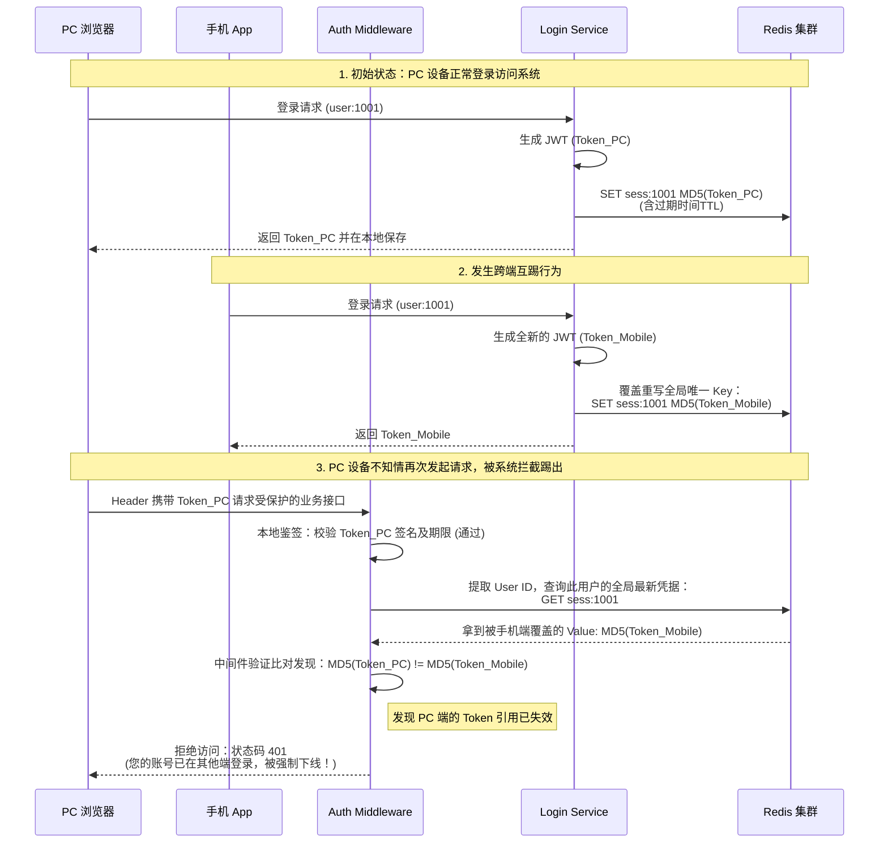

# Bluebell 项目面试 Q&A 面经

这是一份为您量身定制的面试 Q&A 指南。这些回答结合了 Go 后端开发的最佳实践（如 Bluebell 社区项目常考的亮点设计）和微服务/高并发场景下的通用解法，不仅解答了技术细节，还体现了你在架构设计、性能调优和工程实践上的深度思考。

---

### Q1：独立设计并开发这套系统，从技术选型到落地，遇到的最大技术挑战是什么？是如何分析和解决的？
**答：**
在项目开发中，我遇到的最大挑战是**高并发下的投票带来的数据库写压力，以及如何在此场景下保证排行榜的实时性和数据的一致性。**

**分析过程：**
最初的方案是在用户点赞时，直接开启事务同步更新 MySQL 中的“帖子点赞数”和“点赞记录表”。但在压测模拟热点事件推流时，我发现数据库的行锁竞争非常激烈，导致 DB 连接池被打满，接口响应时间出现严重毛刺。同时，每次查询热区排行都要扫表做 Order By，随着数据量增长，这部分成了极其缓慢的慢 SQL。

**解决方案（结合具体场景）：**
我决定将架构演进为**“Redis 核心主导 + Goroutine 异步落库削峰”**。
1. **剥离读写热点**：所有的点赞请求和热度计算不再直接操作 MySQL，而是直接打到 Redis。借助 Redis 的内存级高 IO 性能处理高频的写流量。
2. **异步化落地 MySQL**：在 Redis 层毫秒级完成更新后，接口直接向前端返回成功；接着我单独开辟一个协程（携带脱离当前 Web 请求的 `context.Background()`），去把这条点赞记录异步持久化进 MySQL。这种“内存同步计算 + 异步 IO 落库”的设计实现流量削峰，彻底解除了 DB 的行锁瓶颈。

---

### Q2：如何用 Redis ZSet 实现实时热度排行里的“增量分差计算”？算法如何调整？如何保证数据一致性落盘？
**答：**
**关于“增量分差计算”：**
热度算法（类似 Reddit 的算分机制）通常由“发布时间的时间戳”加上“总投票得分”两部分组成。以一个赞算 432 分为例。传统做法是每次投票都重新查出总赞数算一遍总分，这不仅慢而且有并发覆盖问题。
我利用了 Redis 的 `ZINCRBY` 原子操作只做“差值计算”。比如：
*   **场景 1**：用户初次点赞，增量为 `+432`，直接 `ZINCRBY post_ranking 432 <post_id>`。
*   **场景 2**：用户如果把“踩”改成“赞”，说明原先扣了分，现在要加回来，增量分差就是 `432 * 2 = 864`。直接 `ZINCRBY post_ranking 864 <post_id>`。
利用这种差值计算和 `ZINCRBY` 的原子性，避免了在高并发读取、计算、覆写时产生的竞态条件，并做到了 O(log(N)) 级别的毫秒级更新。

**关于一致性落盘：**
这里存在经典的缓存一致性问题。因为是社区场景的“热度”，我对一致性的诉求属于**最终一致性（Eventual Consistency）**。
我采用了“Write-back（写回）”策略：投票时以 Redis 写入成功为准。接着在 Go 端开启一个异步协程，将点赞记录兜底异步写回 MySQL。为了尽量防止宕机导致数据彻底丢失，我也开启了 Redis 的 AOF（Append Only File）持久化策略。当然，目前采用单机 Goroutine 异步落库，在遇到进程突然崩溃时的确面临微量内存中任务丢失的风险。不过对于“帖子大盘热度”而言，少量的点赞数据丢失是处于业务容忍范围内的权衡取舍。

---

### Q3：性能压测显示 200 并发下吞吐量 1491 req/s，P99 延迟 89ms。是你自己做的吗？关注哪些指标？遇到了什么瓶颈又如何定位优化的？
**答：**
这是我自己使用 go-wrk (或 JMeter) 在本地/测试服务器单机压测得出的数据。
在压测时，我重点关注四大黄金指标：**吞吐量 (QPS/TPS)、P99 响应延迟、错误率 (Error Rate)**，以及服务器的**CPU/内存利用率反馈**。

**发现瓶颈与定位过程：**
在初步压测时，QPS 只能卡在 600 左右，并且 P99 延迟突破了 500ms，CPU 使用率一直上不去。
1.  **定位**：我立即开启了 Go 内置的 `pprof`，通过抓取 Profile 并使用 `go tool pprof` 查看 Goroutine 和 Block 状态。
2.  **瓶颈 1：DB 连接池枯竭**。发现大量 Goroutine 阻塞在等待数据库连接上。优化方案：调整 MySQL 在 Go 中的 `SetMaxOpenConns` 和 `SetMaxIdleConns` 到合理数值（例如从默认的几改到了 100/50），让并发请求有足够的连接复用。
3.  **瓶颈 2：内存频繁分配导致 GC 压力**。在火焰图（Flame Graph）中发现，频繁的字符串拼接（如高频通过 `fmt.Sprintf` 打日志、拼缓存 Key）和原生的 JSON 序列化占用了大量 CPU 并产生了过多临时对象，导致 GC 停顿拉长响应时间。优化方案：1. 针对高频的字符串拼接，改用性能更好的 `strings.Builder` 或预分配切片；2. 替换了原生的 `encoding/json`，改用性能更高且兼容的第三方序列化库（我在项目中同时引入了字节跳动的 `sonic` 和常用的 `json-iterator` 以应对不同场景的极致性能需求）。
经过这些基础中间件与代码层面的调优后，在 200 并发压测下 QPS 稳定在了 1491，P99 稳定控制在了 89ms。

---

### Q4：如果重新设计缓存架构，会有什么改进？在应对热键、穿透、雪崩等方面，现在的方案有什么不足？
**答：**
当前项目采用了单纯的 Redis 集中式缓存架构，虽然能顶住当前的压力，但如果流量再扩大一个量级或应对极端突发流量，依然存在以下**不足与改进空间**：

1.  **关于热点 Key（Hot Key）**：
    *   **不足**：目前某篇帖子如果在微博/抖音爆火，瞬间百万次请求全打向同一个 Redis 节点上的同一个 Key（即帖子的详情数据和热点排名），会直接打满单台 Redis 的网卡和 CPU 导致集群请求超时。
    *   **改进**：引入**多级缓存**方案。在 Go 进程的内存中引入本地缓存（如 BigCache 或 FreeCache）。对于短时间内访问极度频繁的热点 Key，在网关层或业务层直接读本地内存返回，将热点流量阻挡在进程内，保护独立的 Redis 集群。
2.  **关于缓存穿透（Cache Penetration）**：
    *   **不足**：目前如果黑客伪造大量数据库不存在的 `post_id` 进行请求，Redis 未命中后，所有并发都会穿透打向 MySQL 进行查询，瞬间压垮数据库。
    *   **改进**：引入 **布隆过滤器（Bloom Filter）**。在 Redis 层前加一层布隆过滤，系统初始化或有新帖创建时将有效 ID 放入其中。查询时若布隆过滤器判断该 ID 不存在，则直接返回空结果给端上，不放任何非法请求过界。
3.  **关于缓存雪崩（Cache Avalanche）**：
    *   **不足**：目前帖子的缓存过期时间 TTL 可能都是统一设置的固定值（如固定的 1 小时），万一大量帖子同一时刻失效，会引发雪崩击穿到 DB。
    *   **改进**：使用 **随机化打散 TTL**。在设置缓存时，基础时间上加上一个 `[0, 5分钟]` 的随机时间（Jitter）。同时，对核心数据的加载使用**互斥锁（如 Go 内部的 `singleflight`）**，保证同一个 Key 的并发请求，同时只有一个协程真正去底层 DB 捞数据并重建缓存，其余人等待结果共享。

---

### Q5：如何划分领域模型？能否举个具体的“发帖”场景，说明从 Repository 到 Service 再到 Handler 的流转过程？
**答：**
我采用了 DDD 的理念来实现标准的三层分离，核心思想是**底层依赖接口，上层注入实现（依赖倒置）**，从而把框架逻辑（HTTP 解析、DB 操作）和纯粹的业务领域逻辑严格隔离开。

在划分时：
*   **Handler 层（适配层）**：只负责将 HTTP 网络请求翻译成 Go 的数据结构。
*   **Service 层（领域层）**：不关心数据存在哪、怎么存，只关心纯业务规则。
*   **Repository 层（基础设施层）**：只负责与 DB、Redis 的原始 CRUD 对接。

**以“发帖（CreatePost）”这个具体的场景为例的流转过程：**

1.  **Handler 层接收请求 `PostHandler.Create()`：**
    *   解析前端传来的 JSON（提取标题、内容、板块 ID），完成参数的合法性校验（比如长度限制）。
    *   从 `Context` 获取当前登录用户的鉴权信息（User ID）。
    *   随后调用下层的接口：`h.postService.CreatePost(ctx, postParam)`。得到结果后，组装统一的 JSON 格式（包含错误码）返回给前端。
2.  **Service 层处理业务逻辑 `PostService.CreatePost()`（核心领域逻辑）：**
    *   第一步：调用独立的生成器插件，如通过分布式发号器（Snowflake 雪花算法）生成全局唯一的 Post ID。
    *   第二步：在这里组装最终的领域级结构体对象（如附上创建时间、初始点赞数 0）。
    *   第三步：编排后续动作——先调用存放数据的接口 `s.postRepo.InsertPost(post)`。成功后，调用更新缓存的接口 `s.postRepo.InitPostScoreCache(postID)` 将初始化分数送入 Redis。
3.  **Repository 层持久化 `PostRepo.InsertPost()`：**
    *   这一层隐藏了所有 SQL 语句或是 ORM（比如 Gorm）的细节。
    *   它将 Service 传来的 Go 结构体转换成数据库的物理表结构，开启连接，执行 `INSERT INTO ...` 将数据存入 MySQL。

**为什么要这么划分（优势）？**
因为采用**控制反转与依赖注入（DI）**，`Service` 结构体里面持有的都是 `Repository` 的 `interface`，而不是具体实现的结构体。
这带给我在工程中极大便利：如果我要对 Service 层写单元测试，我不用真的去连一个 MySQL 测试库，只需要把 `Repository interface` 使用 `gomock`  Mock 掉，就可以快速验证 Service 层“发帖生成唯一 ID”这段核心逻辑的正确性了。极大提高了代码可测试性和业务稳定性。

---

### Q6：场景题：假设现在需要设计一个高可用的用户登录状态管理方案，支持多端登录限制（如手机端和 PC 端互踢），你会如何设计？
**答：**
针对“高可用”和“多端互踢”的需求，我会基于 **JWT (无状态) + Redis (集中式状态维护)** 并行的方案进行设计。这既保留了 JWT 本身无需高频查询 DB 的高性能鉴权优势，又通过引入 Redis 补充了会话管控与踢人能力。

**核心设计逻辑：**

1. **Token 结构设计**：
    * 采用双 Token 机制：`Access Token`（短效，如 2 小时）用于频繁的 API 请求；`Refresh Token`（长效，如 7 天）用来实现过期后无感刷新拦截。
    * 在 JWT 的 Payload（载荷）中注入 `User ID` 以及 **`Client Type`（客户端类型，如 `pc`, `mobile`）**。Client Type 主要用来在拦截时，给前端返回更为精准的踢出提示（比如：“您的账号已在手机端登录”）。

2. **状态存储 (Redis)**：
    * 为了实现“手机端和 PC 端互踢”（即用户全局只有一台设备能在线），在 Redis 中只需要维护该用户**全局唯一的最新 Token 指纹**。
    * Key 统一设置为 `sess:{user_id}`（例如：`sess:1001`）。
    * Value 设置为系统刚颁发的新 Token （或对其进行 MD5 摘要后的串 / 甚至只签发 UUID `jti`），过期时间 TTL 与 `Refresh Token` 保持一致。

3. **互踢机制 (踢下线)**：
    * 当原本在 PC 端在线的用户，拿起手机（Mobile）重新登录并且成功时，后端生成新的 Token 返回。
    * **关键步骤**：后端强制 **覆盖写入** Redis 里的全局唯一 Key `sess:{user_id}`，将 Value 刷新为手机端新颁发 Token 的对应值。此时，PC 端的 Token 虽本身尚未过期，但它在 Redis 中的“全局唯一有效参考值”已经被无缝替换成手机端的 Token 了。

4. **请求验证流转**：
    * 该用户放下手机再次在电脑上操作，携带旧 PC 端的 Token 请求业务接口，首先经过 Auth Middleware 层。
    * 层内解析验证 JWT 本身的签名强关联与绝对过期时间（若无效则直接 Reject 返回 401）。
    * 若 JWT 结构合法，提取出其中的 `User ID`，直接去 Redis 查询全局唯一的 `sess:{user_id}` 。
    * **校验判定：** 如果 Redis 中查出的值 **不等于** 当前请求（PC端）所携带 Token 的凭据，说明用户的会话已经被其他设备（即刚刚登录的手机端）彻底挤占覆盖了。由于不同端生成的 Token MD5 绝不相同，此时网关层直接拦截并抛出精准的业务报错：“您的账号已在其他终端登录，请重新登录！”。

5. **高可用降级策略**：
    * 架构侧，Redis 采用主从哨兵或集群模式部署保证高可用。
    * **熔断降级：** 极小的系统必须具备容灾能力。一旦监控到 Redis 响应剧烈超时或彻底宕机，Auth 中间件应捕获此类内部 error 并**短路**，放弃尝试从 Redis 拉取 `GET` 校验。直接降级为“**完全依赖无状态的 JWT 自身合法性校验**”。在极端情况下，系统虽然会短暂丧失“互踢”能力，但核心业务链路不受阻，保住了整体站点的基础登录可用性。

**简要数据流转图：**

